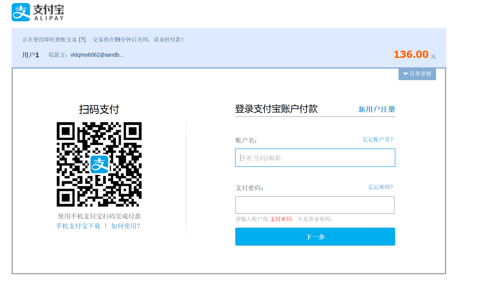
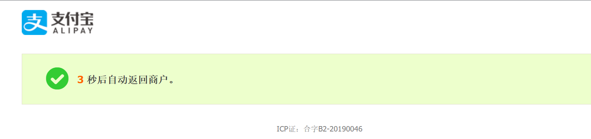
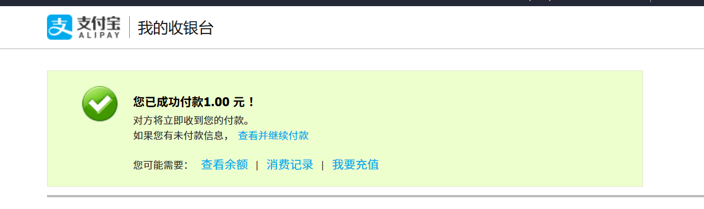
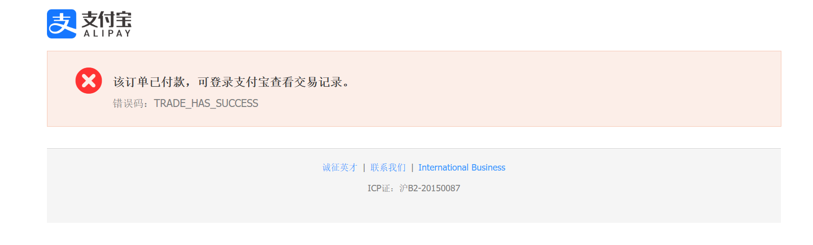
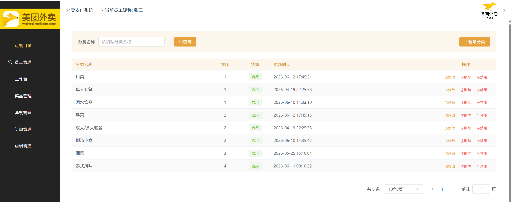
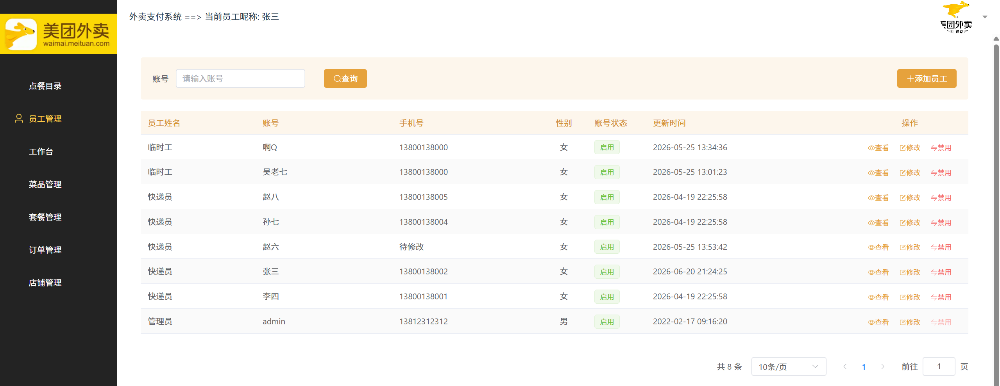
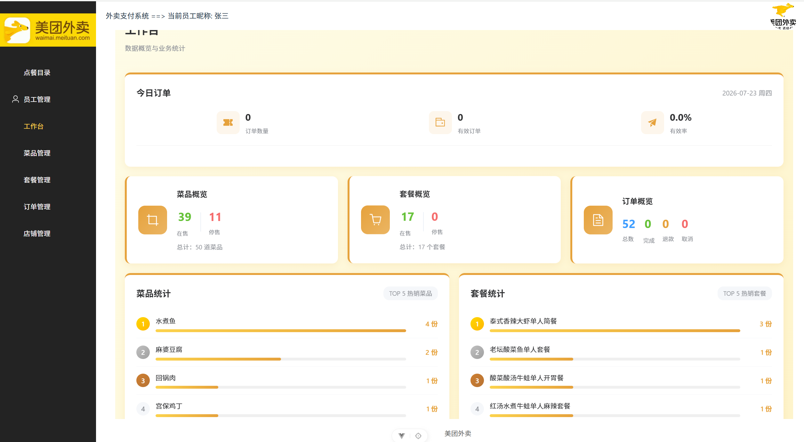
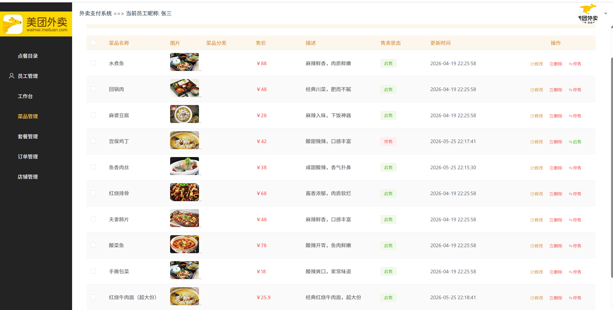
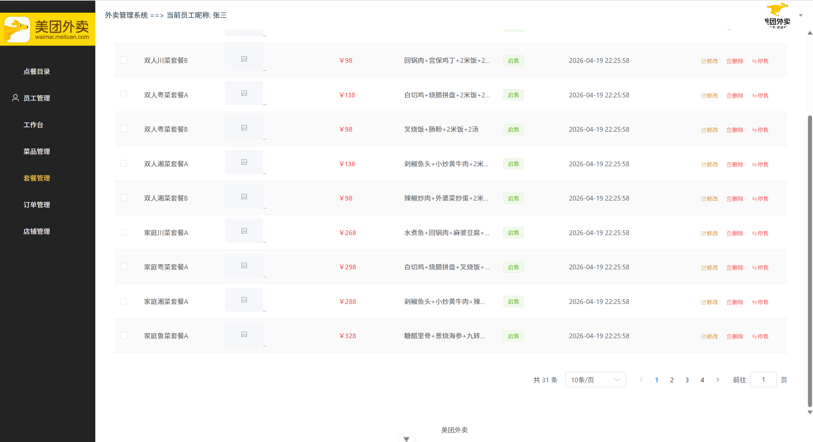
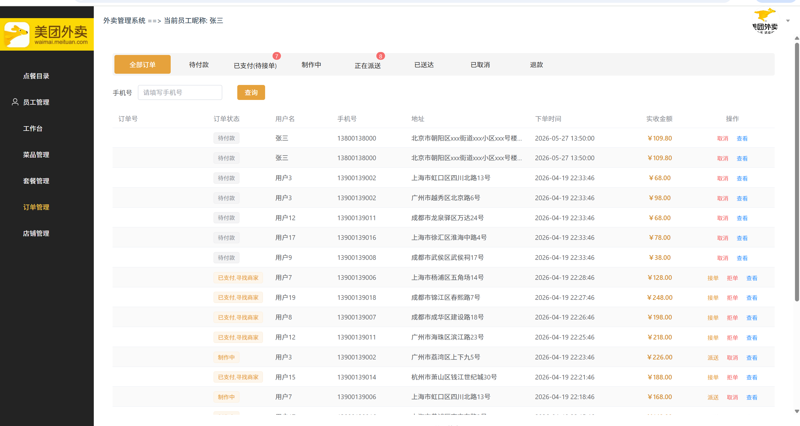

# TakeOut 外卖餐饮管理系统

一个基于 Spring Boot 3 + Vue 3 的全栈外卖餐饮管理系统，前后端分离系统。提供完整的用户端和管理端功能，支持菜品管理、套餐管理、订单处理、支付集成、实时通信等核心能力。

---

## 后端依赖说明

### 订单状态流转

```
* 1 待支付：下单未付款
* 2 待商家接单：已付款，商家还没接单
* 3 商家接单，制作中：商家确认接单，正在做菜
* 4 待骑手取餐：商家出餐完成，骑手还没到店
* 5 骑手已取餐，配送中：骑手拿到餐，在路上，实时看定位
* 6 骑手已送达：骑手点送达，等待用户确认
* 7 订单已完成：系统自动确认收货
* 8 订单已取消：未接单退款、商家拒单、超时取消、售后全额退款
```

---

## 

### 用户端功能依赖
| 依赖 | 版本 | 功能支撑 |
| :--- | :--- | :--- |
| Spring Boot Web | 3.3.8 | 用户端 Controller 提供 REST 接口（注册、登录、菜品浏览、订单提交等） |
| MyBatis-Plus | 3.5.9 | UserMapper/DishMapper/OrderMapper 等实现用户、菜品、订单数据 CRUD；AutoMetaObjectHandler 自动填充元数据字段 |
| JJWT API/Impl/Jackson | 0.12.6 | JwtUtil 生成登录 Token，JwtTokenUserInterceptor 验证 Token 并实现无状态认证 |
| Spring Boot Starter Data Redis | 3.3.8 | 缓存用户 Token、购物车数据，支持单点登录和过期失效 |
| Spring Boot Starter WebSocket | 3.3.8 | WebSocketServer 实现订单状态实时推送、消息通知 |
| Spring Boot Starter Validation | 3.3.8 | @NotNull、@Size 等注解校验注册、登录、地址等参数合法性 |
| Hutool All | 5.8.26 | BeanUtil 对象属性拷贝、StrUtil 字符串判空、JSONUtil 序列化/反序列化 |
| Lombok | — | @Data、@Builder 等简化实体类、DTO、VO 代码 |

### 管理端功能依赖
| 依赖 | 版本 | 功能支撑 |
| :--- | :--- | :--- |
| MyBatis-Plus | 3.5.9 | EmployeeMapper/CategoryMapper 等实现员工、分类、套餐数据 CRUD；分页查询支持 |
| JJWT | 0.12.6 | JwtTokenAdminInterceptor 验证管理员 Token |
| Spring Boot Starter Data Redis | 3.3.8 | 缓存管理员 Token，支持登录态管理 |
| Spring Boot Starter Validation | 3.3.8 | 校验员工、菜品、套餐等参数的合法性 |
| Hutool All | 5.8.26 | 各类工具类支持业务逻辑处理 |

### 订单与支付功能依赖
| 依赖 | 版本 | 功能支撑 |
| :--- | :--- | :--- |
| 支付宝 SDK (alipay-sdk-java) | 4.40.658.ALL | AlipayController 集成支付宝支付、退款、回调处理 |
| 微信支付 SDK (wechatpay-apache-httpclient) | 0.6.0 | WeChatPayUtil 实现微信支付集成 |
| EasyExcel | 3.3.2 | ExcelReportController 导出订单数据报表 |
| Spring Boot Starter WebSocket | 3.3.8 | 订单状态变更实时推送至用户端 |

### 支付流程

| 集成到order  |  |
| ------------ | ---------------------------------- |
| 支付过程     |  |
| 同步支付成功 |  |
| 异步检验     |  |


### 文件与存储功能依赖

| 依赖 | 版本 | 功能支撑 |
| :--- | :--- | :--- |
| 阿里云 OSS SDK | 3.17.4 | OSSFileController 实现图片上传到阿里云 OSS，返回 CDN 访问 URL |
| Spring Boot Web | 3.3.8 | LocalFileController 实现本地文件上传/下载 |
| Apache HttpClient | 4.5.14 | HttpClientUtil 支持 HTTP 请求调用 |

### 系统基础设施依赖
| 依赖 | 版本 | 功能支撑 |
| :--- | :--- | :--- |
| Spring Boot | 3.3.8 | 应用框架，自动配置数据源、Redis、WebSocket 等基础设施 |
| Spring Boot Starter AOP | 3.3.8 | 自定义 @Info 注解 + AOP 切面记录方法执行耗时、参数、返回值 |
| MySQL Connector | 8.0.32 | 关系型数据库连接驱动 |
| Spring Boot Starter Cache | 3.3.8 | 缓存注解支持 |
| Jakarta XML Bind | 4.0.2 | XML 数据处理 |

### 安全机制

| 安全措施       | 实现方式                                        |
| :------------- | :---------------------------------------------- |
| JWT Token 认证 | 用户和管理员登录后获得 Token，请求需携带 Token  |
| 密码加密       | 用户密码使用 MD5 加密存储                       |
| Redis 缓存     | Token 存储在 Redis 中，支持单点登录和过期失效   |
| 请求拦截器     | 用户端和管理端各配置独立拦截器验证 Token 有效性 |
| AOP 操作日志   | 通过 @Info 注解 + AOP 切面记录关键操作          |

## 前端依赖说明

| 依赖 | 版本 | 功能支撑 |
| :--- | :--- | :--- |
| Vue | 3.5.32 | 前端框架，响应式 UI 构建 |
| Element Plus | 2.14.1 | UI 组件库，表格、表单、对话框、菜单等组件 |
| Vue Router | 4.6.4 | 前端路由管理，页面导航与权限控制 |
| Pinia | 3.0.4 | 状态管理库，管理用户登录态、JWT Token |
| Axios | 1.17.0 | HTTP 客户端，封装 API 请求与响应拦截 |
| Pinia Plugin Persistedstate | 4.7.1 | Pinia 状态持久化插件 |
| Vite | 8.0.8 | 前端构建工具 |
| Sass | 1.100.0 | CSS 预处理器 |

---

### 功能特性

- **双端分离**：完整的用户端（消费者）和管理端（商家/管理员）功能
- **菜品与套餐管理**：支持菜品/套餐的增删改查、上下架、分类管理
- **订单全流程**：提交订单 → 支付 → 接单 → 配送 → 完成，完整状态流转
- **支付集成**：支持支付宝支付（含退款）、微信支付
- **实时通信**：基于 WebSocket 的订单状态实时推送与消息通知
- **数据报表**：Excel 报表导出、工作台数据统计、销量排行
- **文件存储**：支持本地存储和阿里云 OSS 两种文件存储方式
- **安全机制**：JWT Token 认证、密码加密、Redis 缓存、请求拦截器
- **定时任务**：超时订单自动取消、配送超时监控
- **AOP 日志**：方法执行耗时、参数、返回值自动记录

---

### 功能演示

### 管理端界面

| 功能页面 | 截图 |
| :--- | :--- |
| 登录页面 |  |
| 工作台首页 |  |
| 菜品管理 |  |
| 套餐管理 |  |
| 订单管理 |  |
| 分类管理 |  |
| 员工管理 |  |

---

### 商家端界面

### 用户端界面

## 项目结构

```
backend-spring-takeout/
├── start/                    # 启动模块（Spring Boot 应用入口）
│   ├── src/main/java/start/
│   │   ├── annotation/       # 自定义注解（@Info）
│   │   ├── aop/              # AOP 切面（日志记录）
│   │   ├── config/           # 配置类（Redis、WebSocket、MyBatis 等）
│   │   ├── controller/       # REST 控制器
│   │   │   ├── user/         # 用户端接口
│   │   │   ├── admin/        # 管理端接口
│   │   │   ├── pay/          # 支付接口
│   │   │   ├── file/         # 文件上传接口
│   │   │   ├── excel/        # Excel 报表接口
│   │   │   ├── timetask/     # 定时任务
│   │   │   └── websocket/    # WebSocket 通信
│   │   ├── exceptionHandle/  # 全局异常处理
│   │   ├── interceptor/      # 请求拦截器（JWT 验证）
│   │   ├── metaHandler/      # 元数据自动填充
│   │   └── TakeOutApplication.java
│   └── src/main/resources/
│       ├── application.yml   # 应用配置
│       └── mapper/           # MyBatis 映射文件
├── service/                  # 业务逻辑层
│   └── src/main/java/service/
│       ├── ISevcive/         # 服务接口定义
│       └── impl/             # 服务实现类
├── mapper/                   # 数据访问层（MyBatis Mapper）
├── model/                    # 数据模型层
│   └── src/main/java/pojo/
│       ├── dto/              # 数据传输对象
│       ├── entity/           # 数据库实体
│       ├── entityenum/       # 枚举类型
│       └── vo/               # 视图对象
├── common/                   # 公共模块
│   └── src/main/java/common/
│       ├── constant/         # 常量定义
│       ├── enumeration/      # 枚举定义
│       ├── exception/        # 自定义异常
│       ├── properties/       # 配置属性类
│       ├── result/           # 统一响应封装
│       └── utils/            # 工具类（JwtUtil、AliOssUtil 等）
├── ai-hotline/               # AI 热线模块（Spring AI 集成）
└── pom.xml                   # 父 POM 配置

frontend-vue-admin-takeout/   # 前端管理端（Vue 3）
├── src/
│   ├── api/                  # API 接口封装
│   ├── router/               # 路由配置
│   ├── stores/               # 状态管理（Pinia）
│   ├── utils/                # 工具函数
│   ├── views/                # 页面组件
│   │   ├── category/         # 分类管理
│   │   ├── dish/             # 菜品管理
│   │   ├── employee/         # 员工管理
│   │   ├── orderDetails/     # 订单管理
│   │   ├── setmeal/          # 套餐管理
│   │   ├── shop/             # 店铺管理
│   │   └── workspace/        # 工作台统计
│   └── layout/               # 布局组件
├── package.json
└── vite.config.js
```

---

## 环境要求

- **JDK**: 17+
- **Node.js**: 20.19.0+ 或 22.12.0+
- **MySQL**: 8.0+
- **Redis**: 6.0+
- **Maven**: 3.8+

---

